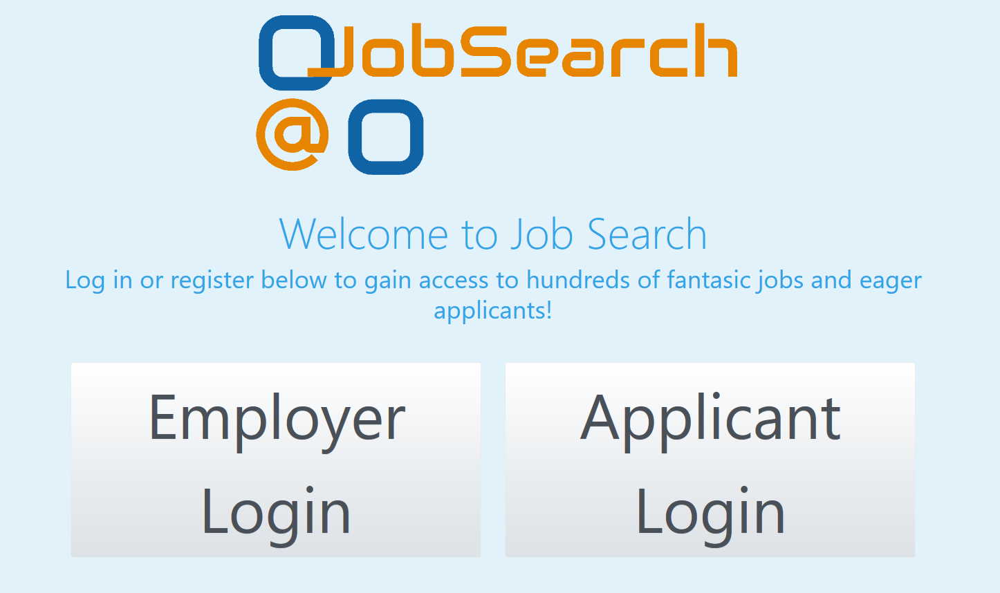

# JobSearch: A Web App to Create and Apply to Jobs

## Project Description

JobSearch is a web application that allows employers to create and manage job posts, and applicants to search through and apply to jobs with a single click. Applicants can attach personal resumes which can be viewed or downloaded by employers.

Technologies used include .NET, MVC, Entity, Identity, and Bootstrap.

## Instructions

1. Clone this repository
1. Open the solution using Visual Studios
1. Using the Packet Manager Console, "Update-Database"
1. Execute the app to begin.
1. Register either a new Employer or new Applicant 

## Author

* **Spencer Truett** - (https://github.com/SpencerTruett)